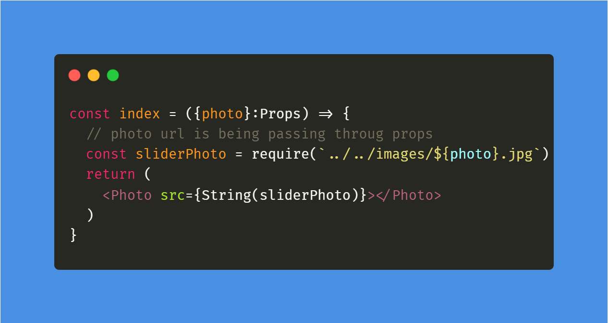

# Frontend Mentor - Coding bootcamp testimonials slider solution

This is a solution to the [Coding bootcamp testimonials slider challenge on Frontend Mentor](https://www.frontendmentor.io/challenges/coding-bootcamp-testimonials-slider-4FNyLA8JL). Frontend Mentor challenges help you improve your coding skills by building realistic projects. 

## Table of contents

- [Overview](#overview)
  - [The challenge](#the-challenge)
  - [Screenshot](#screenshot)
  - [Links](#links)
- [My process](#my-process)
  - [Built with](#built-with)
  - [What I learned](#what-i-learned)
- [Author](#author)

## Overview

### The challenge

Users should be able to:

- View the optimal layout for the component depending on their device's screen size
- Navigate the slider using either their mouse/trackpad or keyboard

### Screenshot

### Links

- Solution URL: [GitHub](https://github.com/Danielhu3/testimonial-slider)
- Live Site URL: [Netlify](https://your-live-site-url.com)

## My process

### Built with

- Semantic HTML5 markup
- CSS custom properties
- Flexbox
- CSS Grid
- [React](https://reactjs.org/) - JS library
- [TypeScript](https://www.typescriptlang.org/) - JavaScript Superset / Programming language
- [Styled Components](https://styled-components.com/) - For styles

### Dependencies 

Styled-components:
 - Library to use CSS-in-JS
 - npm install styled-components

@types/styled-components:
 - Styled components definitions for typescript
 - npm install @types/styled-components -D

### What I learned

- I have some trouble to show reactive photos, so i use require to get the photo url and pass use it to image src

## Author

- Frontend Mentor - [@Danielhu3](https://www.frontendmentor.io/profile/Danielhu3)
- Twitter - [@danielmaggot_](https://www.twitter.com/danielmaggot_)

